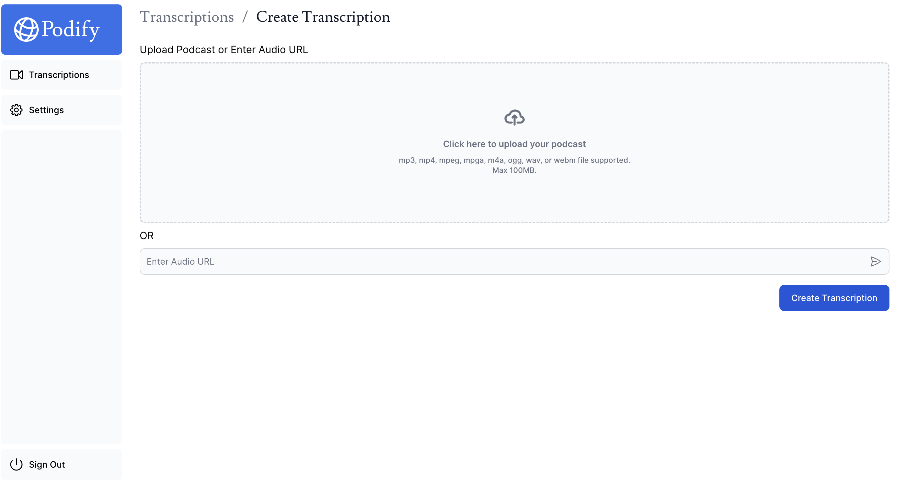

## 介绍

一个可以 self-hosted 在 Vercel 的项目，用于转录播客, [Live Project](https://podify-web.vercel.app/)

## 实现功能

1. 登录注册
2. 播客转录的增删改查
3. Summarize 播客文本

## 如何部署

1. fork or clone 代码
2. 按照[官方教程](https://nextjs.org/learn/dashboard-app/setting-up-your-database)部署
